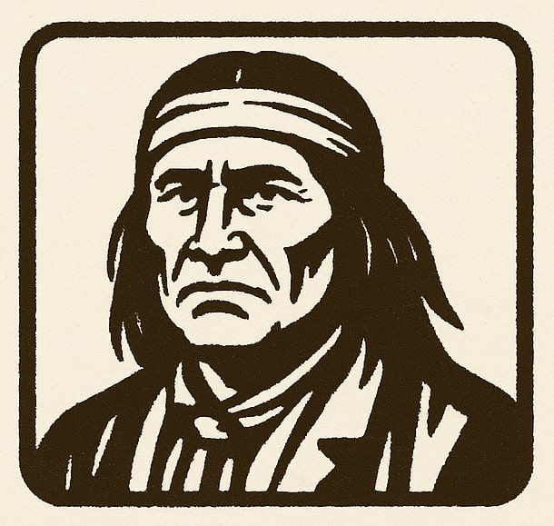
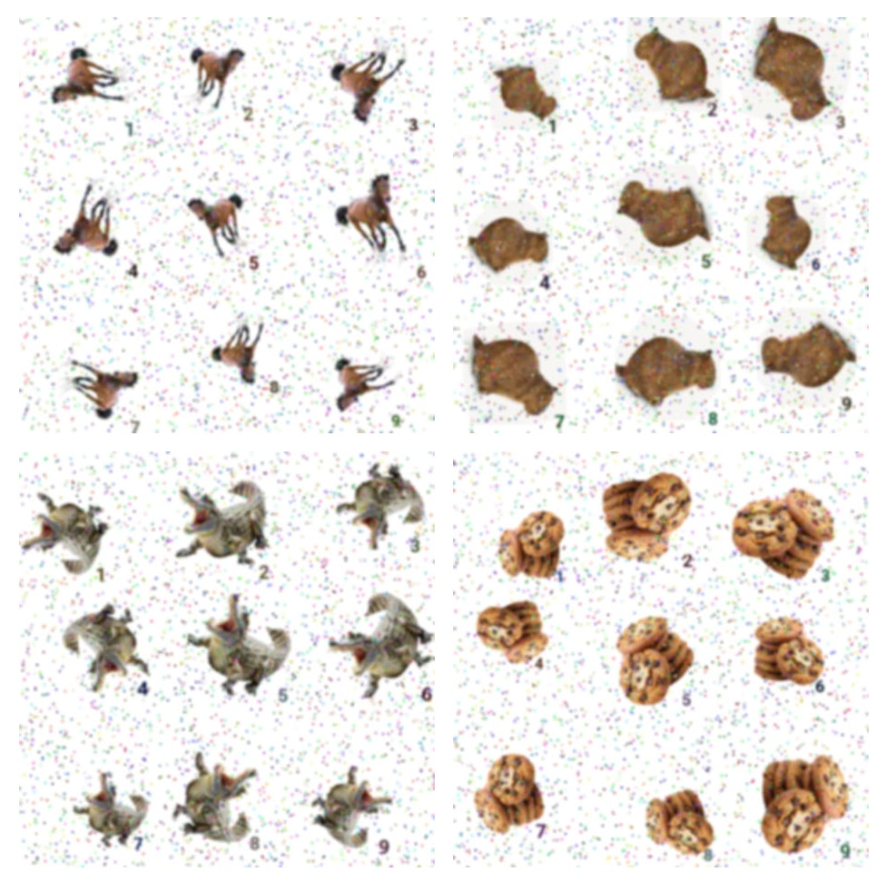

# geronimo-captcha

[](https://github.com/yoozzeek/geronimo-captcha/actions/workflows/ci.yml)
[](https://crates.io/crates/geronimo-captcha)
[](https://docs.rs/geronimo-captcha)
[](./LICENSE)

Secure, AI-resistant, JavaScript-free CAPTCHA built in Rust.
Confuses bots, but delights humans.



## What it does

- Renders a 3×3 sprite with one correctly oriented tile
- Random jitter, label offset, colored noise, JPEG artifacts
- Stateless HMAC-signed challenge id with TTL

### Challenge examples



## Roadmap

- [x] Captcha core, image and sprite generation helpers
- [x] In-memory challenge registry impl
- [x] Sprite as binary (in addition to base64)
- [x] WebP format (in addition to JPEG)
- [ ] Code examples, demo webpage
- [ ] Custom fonts and sample sets
- [ ] Redis challenge registry impl

## Generate and verify

```rust
use geronimo_captcha::{
    CaptchaManager, ChallengeInMemoryRegistry,
    GenerationOptions, NoiseOptions,
    SpriteFormat, SpriteUri, SpriteBinary
};

fn main() -> Result<(), Box<dyn std::error::Error>> {
    let ttl_secs = 60;
    let registry = std::sync::Arc::new(ChallengeInMemoryRegistry::new(ttl_secs, 3));
    let noise = NoiseOptions::default();
    let gen = GenerationOptions {
        cell_size: 150,
        sprite_format: SpriteFormat::Jpeg {
            quality: 70,
        },
        limits: None,
    };

    let secret = "your-secret-key".to_string();
    let mgr = CaptchaManager::new(secret, ttl_secs, noise, Some(registry), gen);
    let challenge = mgr.generate_challenge::<SpriteUri>()?;

    // Generate sprite as binary if needed
    // let challenge = mgr.generate_challenge_with::<SpriteBinary>()?;
    // let img_binary = challenge.sprite.bytes;

    // Render to client
    let img_src = challenge.sprite.0;           // data:image/*;base64,...
    let challenge_id = challenge.challenge_id;  // send/store with form

    println!("img_src prefix: {}", &img_src[..32.min(img_src.len())]);
    println!("challenge_id: {}", challenge_id);

    // Normally you get these from the client in your API handlers/routes
    let client_challenge_id = "nonce:1730534400:BASE64_HMAC".to_string();
    let client_choice_idx: u8 = 7;

    let ok = mgr.verify_challenge(&client_challenge_id, client_choice_idx)?;
    println!("verified: {ok}");

    Ok(())
}
```

## Benchmarks

### 100px/cell; q=70

- Verify: ~2.5 µs
- JPEG generate:
    - ~6.7 ms
    - ~5.0 ms (parallel)
- WebP generate:
    - ~11.5 ms
    - ~10.7 ms (parallel)

_Apple M3 Max_

How to run:

```bash
cargo bench --bench captcha -- --noplot
cargo bench --bench captcha --features parallel -- --noplot
```

## License

This project is licensed under the Apache 2.0 License. See [LICENSE](./LICENSE) for details.
