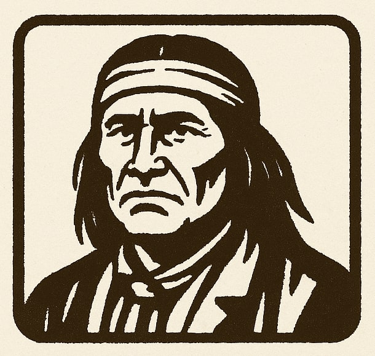
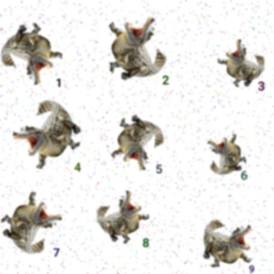
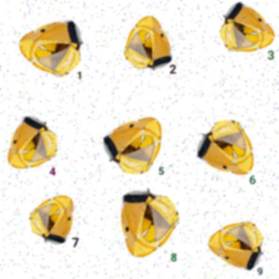
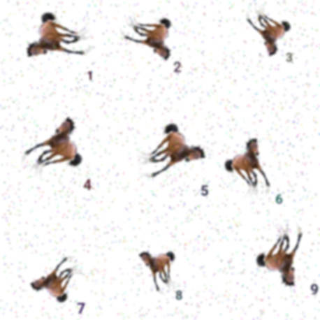

# geronimo-captcha

[](https://github.com/yoozzeek/geronimo-captcha/actions/workflows/ci.yml)
[](https://crates.io/crates/geronimo-captcha)
[](https://docs.rs/geronimo-captcha)
[](./LICENSE)



A JavaScript-free CAPTCHA for Rust.

A speed bump for bulk automation, layered over server-side rate limiting. Not a wall.
Image-only: provide your own accessible fallback.

- Renders a 3×3 sprite with one correctly oriented tile
- Random jitter, label offset, colored noise, JPEG artifacts
- HMAC-signed challenge id with TTL; a `ChallengeRegistry` makes it single-use

### Examples





Regenerate with `cargo run --example gen_examples`.

## Generate and verify

```rust,no_run
use geronimo_captcha::{
    CaptchaManager, ChallengeInMemoryRegistry, DecodeLimits,
    GenerationOptions, NoiseOptions, SampleFormat,
    SampleSet, SpriteFormat, SpriteUri, SpriteBinary
};

fn main() -> Result<(), Box<dyn std::error::Error>> {
    let ttl_secs = 60;
    let max_attempts = 3;
    let max_entries = 100_000;

    let registry = std::sync::Arc::new(
        ChallengeInMemoryRegistry::new(ttl_secs, max_attempts, max_entries)?
    );

    let noise = NoiseOptions::default();
    let opts = GenerationOptions {
        cell_size: 150,
        sprite_format: SpriteFormat::Jpeg {
            quality: 70,
        },
        rounds: 1,
        limits: DecodeLimits::default(),
    };

    // Your own images. See "Choosing a sample corpus" below
    let images = std::fs::read_dir("/srv/captcha-corpus")?
        .filter_map(|e| std::fs::read(e.ok()?.path()).ok())
        .collect();
    let samples = SampleSet::new(SampleFormat::Jpeg, images)?;

    // Must be at least 32 bytes. Zeroized on drop
    let secret = std::env::var("CAPTCHA_SECRET")?;
    let mgr = CaptchaManager::new(secret, ttl_secs, noise, Some(registry), opts, &samples)?;

    let challenge = mgr.generate_challenge::<SpriteUri>()?;

    // Generate sprites as binary if needed
    // let challenge = mgr.generate_challenge::<SpriteBinary>()?;
    // let img_binary = &challenge.sprites[0].bytes;

    // One sprite per round. Render each into the form
    let img_src = &challenge.sprites[0].0;      // data:image/*;base64,...
    let challenge_id = &challenge.challenge_id; // send/store with form

    // Normally you get these from the client in your API handlers/routes.
    // One index per round, in issue order
    let client_choice: [u8; 1] = [7];

    let ok = mgr.verify_challenge(challenge_id, &client_choice)?;
    println!("verified: {ok}");

    Ok(())
}
```

`CaptchaManager::new`, `ChallengeInMemoryRegistry::new`, `NoiseOptions` and
`GenerationOptions` are validated at construction. A secret under 32 bytes, a TTL outside
`1..=86400`, a `cell_size` outside `16..=1024` or an inverted `color_range` are rejected
with `CaptchaError::InvalidInput`.

Without a registry the challenge id is still authenticated, but nothing stops a client
submitting all nine indices. Do not run in production without one.

`ChallengeInMemoryRegistry` is per-process. Behind a load balancer, implement
`ChallengeRegistry` over shared storage or pin each client to one instance.

## Choosing a sample corpus

The corpus is the security boundary, not the noise and not the JPEG quality.

Every tile is masked to the same circle, the grid geometry carries no orientation signal.
Any corpus works; the subject does not have to sit on a white field.

An attacker holding your source images renders each one at every rotation offline and
matches the upright tile by correlation. No model is involved. Measured against a known
corpus, with a median filter applied first to strip the noise:

| preprocessing                   | cell=100 | cell=150 |
|---------------------------------|----------|----------|
| clean sprite                    | 100.0%   | 75.5%    |
| noise + blur, as shipped        | 15.0%    | 15.5%    |
| noise + blur, then 11x11 median | 99.5%    | 76.5%    |

Chance is 11.11%, 200 trials per cell size.

`SampleSet::demo_insecure()` returns the eight images published inside this crate. They are
on crates.io and anyone can precompute them. Tests and examples only.

For deployment, supply your own images and rotate them. A static corpus of `n` images is
fully harvested in roughly `n * ln(n)` requests, after which its size stops helping: 8
images fall in about 17 requests, 1000 in about 7000. Corpus size buys bootstrap cost, not
immunity.

## Benchmarks

### 100px/cell; q=70

- Verify: ~0.43 µs
- JPEG generate:
    - ~2.7 ms
    - ~2.4 ms (parallel)
- WebP generate:
    - ~3.8 ms
    - ~3.6 ms (parallel)

_Apple M3 Max_

How to run:

```bash
cargo bench --bench captcha -- --noplot
cargo bench --bench captcha --features parallel -- --noplot
```

## License

This project is licensed under the Apache 2.0 License. See [LICENSE](./LICENSE) for details.
